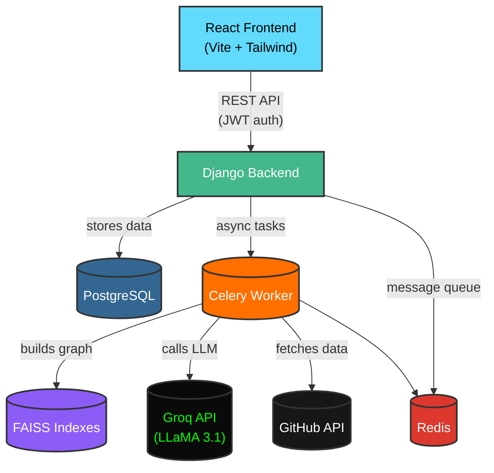

# 🧠 RepoInsight

> **Learn by doing. Not by copying.**

RepoInsight is an AI-powered tutor that helps developers contribute to open-source projects. It matches your skills to real GitHub issues, guides you through understanding problems with Socratic questioning, and provides guarded code assistance only when you are genuinely stuck. A persistent learner profile remembers your progress across sessions, and a novel **semantic graph** ensures you see fresh, relevant recommendations.

---

## 🛡️ Badges

| Python                                                                                             | Django                                                                                            | React                                                                                         | License                                                   | Build                                                                                     |
| -------------------------------------------------------------------------------------------------- | ------------------------------------------------------------------------------------------------- | --------------------------------------------------------------------------------------------- | --------------------------------------------------------- | ----------------------------------------------------------------------------------------- |
|  |  |  |  |  |

---

## Core Features

- 🎯 **Skill-Based Issue Matching** – FAISS-powered semantic graph matches your skills to open GitHub issues.
- 🔄 **Novelty Score** – Temporal decay based on merged PRs prevents stale recommendations.
- **Socratic Guidance** – The AI never gives you code directly; it asks questions until you demonstrate understanding.
- 🔒 **Ethical Guardrails** – Maximum 3 boilerplate code assists per session, with TODO comments.
- 📈 **Learner Profile** – Mastered skills and completed issues are tracked across multiple sessions.
- 🧪 **Built-in Evaluation** – Synthetic dataset and metrics (Precision@5, NDCG@5, Novelty, Guardrail compliance) ready for research papers.
- 🌗 **Polished Chat UI** – React frontend with collapsible sidebar, markdown rendering, syntax highlighting, and dark/light mode.

---

## 🏗️ System Architecture



### 🔍 Component Details

| Component           | Tech Stack                               | Description                                                                         |
| ------------------- | ---------------------------------------- | ----------------------------------------------------------------------------------- |
| **React Frontend**  | React 19, Vite, Tailwind CSS v4, Base UI | Modern chat interface with `react-markdown`, syntax highlighting, and theme toggle. |
| **Django REST API** | Django, DRF, SimpleJWT                   | Authentication, repository analysis, chat sessions, and learner profiles.           |
| **Celery Worker**   | Celery, Redis                            | Async repository indexing and LangGraph agent processing.                           |
| **Semantic Graph**  | FAISS, Sentence-Transformers             | Vector search for skill-based matching with novelty scoring.                        |
| **LLM Inference**   | Groq (LLaMA 3.1)                         | Low-latency reasoning for Socratic guidance and code review.                        |

---

## 🚀 Getting Started

### Prerequisites

- **Python 3.11+**
- **Node.js 18+** & npm
- **PostgreSQL ≥ 13**
- **Redis ≥ 6**
- **Groq API Key** (for LLM inference)
- **GitHub Personal Access Token** (for repository fetching)

### 🐍 Backend Setup

1. **Clone & Navigate**

   ```bash
   git clone https://github.com/your-username/repoinsight.git
   cd repoinsight/backend
   ```

2. **Virtual Environment & Install**

   ```bash
   python -m venv venv
   source venv/bin/activate    # Windows: venv\Scripts\activate
   pip install -r requirements.txt
   ```

3. **Environment Configuration**
   Create a `.env` file in the `backend` directory:

   ```env
   SECRET_KEY=your-django-secret-key
   DEBUG=True
   DATABASE_PASSWORD=your-postgres-password
   DATABASE_PORT=5432
   GROQ_API_KEY=gsk_xxxxxxxxxxxx
   GITHUB_TOKEN=ghp_xxxxxxxxxxxx
   ```

4. **Migrations & Redis**

   ```bash
   python manage.py migrate
   redis-server  # Ensure Redis is running
   ```

5. **Start Services**

   ```bash
   # Terminal 1: Celery Worker
   celery -A repoinsight worker -l info -P threads

   # Terminal 2: Django Server
   python manage.py runserver
   ```

### ⚛️ Frontend Setup

1. **Install Dependencies**

   ```bash
   cd ../frontend
   npm install
   ```

2. **Start Dev Server**
   ```bash
   npm run dev
   ```
   Access at `http://localhost:5173` (API calls are proxied to backend).

---

## 🧪 Evaluation & Research

Run the built-in evaluation script to measure recommendation quality and guardrail effectiveness:

```bash
python manage.py evaluate
```

**Sample Output:**

```text
================================================================================
RECOMMENDATION QUALITY
--------------------------------------------------------------------------------
Profile                   Precision@5  NDCG@5     Novelty    Freshness
--------------------------------------------------------------------------------
Full-stack Intermediate   0.800        0.780      0.883      1.000
DevOps Specialist         0.733        0.719      0.877      0.933
Beginner Python Dev       0.400        0.519      0.818      1.000

================================================================================
AGENT OVERSIGHT & GUARDRAIL EFFECTIVENESS
--------------------------------------------------------------------------------
Persona              FinalPhase      GuardrailOK  StuckCnt   CodeAssists
--------------------------------------------------------------------------------
Eager Learner        review          True         0          0
Lazy Contributor     code_assist     True         4          2
Expert Dev           review          True         0          0
```

---

## 📖 Usage Flow

1. **Login / Sign Up** on the landing page.
2. **Paste a GitHub Repo URL** (e.g., `https://github.com/psf/requests`).
3. **Wait for Analysis** – Backend fetches issues/PRs and builds the semantic graph.
4. **Skill Onboarding** – Describe your experience or use the interactive skill selector.
5. **Receive Recommendations** – Engine suggests issues based on skills and novelty.
6. **Pick an Issue** – Agent enters Socratic mode to question your understanding.
7. **Get Guided** – If stuck, receive boilerplate code with TODOs (max 3 assists).
8. **Review & PR Outline** – After demonstrating understanding, get a PR readiness review and template.

---

## 📂 Project Structure

```
repoinsight/
├── backend/
│   ├── repoinsight/          # Django settings, Celery config, URLs
│   ├── core/                 # Main application logic
│   │   ├── models.py         # User, Repository, Session, Recommendation, Profile
│   │   ├── views.py          # DRF API Endpoints
│   │   ├── tasks.py          # Celery async tasks
│   │   ├── management/       # Custom commands (evaluate)
│   │   └── services/         # Core logic
│   │       ├── agents/       # LangGraph nodes & graph definition
│   │       ├── embeddings.py # FAISS & Sentence-Transformers
│   │       ├── github.py     # GitHub API client
│   │       ├── recommender.py# Matching engine
│   │       └── semantic_graph.py # Graph construction & scoring
│   └── manage.py
├── frontend/
│   ├── src/
│   │   ├── components/
│   │   │   ├── chat/         # ChatPage, CurrentSession, ChatSidebar, SettingsModal
│   │   │   ├── ui/           # Button, Card, Dialog, Input, Badge (Base UI primitives)
│   │   │   ├── LandingPage.jsx
│   │   │   ├── Login.jsx
│   │   │   ├── Signup.jsx
│   │   │   └── ThemeToggle.jsx
│   │   ├── lib/              # API client, session store, utility functions
│   │   ├── App.jsx
│   │   └── main.jsx
│   ├── index.html
│   ├── package.json
│   ├── vite.config.js
│   └── eslint.config.js
└── README.md
```

---

## 🤝 Contributing

We welcome contributions! Please follow these steps:

1. **Fork** the repository.
2. **Create a branch** (`git checkout -b feat/your-feature`).
3. **Commit changes** with clear messages.
4. **Push** to your fork.
5. **Open a Pull Request** against `main`.

**Development Standards:**

- Backend: `ruff` + `pre-commit`
- Frontend: `eslint` + `prettier`

---

## License

This project is licensed under the **MIT License**. See the [LICENSE](LICENSE) file for details.

---

## 🙏 Acknowledgements

- [LangGraph](https://langchain-ai.github.io/langgraph/) – Agent orchestration.
- [Groq](https://groq.com/) – Fast LLM inference.
- [FAISS](https://github.com/facebookresearch/faiss) – Vector similarity search.
- [Sentence-Transformers](https://www.sbert.net/) – Embedding models.
- [Shadcn UI](https://ui.shadcn.com/) – Component inspiration.
